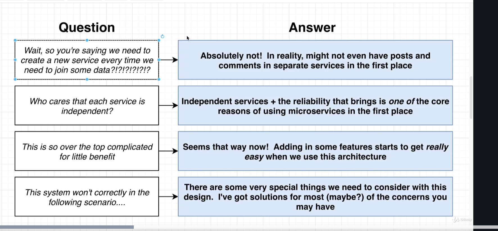

# The Blog App

## Some good habits to have when working with microservices

- Whenever you start designing a service or putting it together, it is worth thinking very critically about exactly what your services want to do.

## The services and solutions for the blog app

- The goal of post service

| path    | method | body?          | goal                  |
| ------- | ------ | -------------- | --------------------- |
| /posts/ | POST   | {title:string} | create a new post     |
| /posts/ | GET    | -              | retriew all the posts |

- The goal of comment service

| path                | method | body?            | goal                  |
| ------------------- | ------ | ---------------- | --------------------- |
| /posts/:id/comments | POST   | {content:string} | create a new post     |
| /posts/:id/comments | GET    | comment[]        | retriew all the posts |

- Import a Query service Posts
  - the data schema for query service
    |id | title|comments|
    |---|------|---------|
    |he23| Yes | [] |
  - Event format for query service

```ts
type PostEvent = {
  type: "PostCreated" | "PostDeleted";
  data: { id: string; title?: string };
};

type CommentEvent = {
  type: 'CommentCreated" | "CommentDeleted" | "CommentUpdated",
  data: {commentId:string, postId?:string}
}
```

- Q & A for the solution
  

- Solutions for adding a moderation service

  - Option One: send comment event from moderation to query service
    > 1.  cons: what if the moderation operation handled by a human?
  - Option Two: send the comment both to the moderation service and query service.

    - cons
      - There could be many event sources for comment
      - We require a presentation services to have a deeper understanding of logic

  - Option three:
    make the comment to handle comments related business logic handling
    > 1.  Domain related event
    > 2.  Generic event
    - pros
      - the query service only care about **update** event, compared with caring about a bunch of events

**Notice here, the comment service keeps the full data of comments**, we have a palce that stores the **integral comment data**.

- handle service failure or services brought in the future

  1.  Sync request
  2.  Directly database access(what if post and comment services using different type database, we will bring query handling inside the query service)

  3.  **Store Event**(real world solution) at the event-bus service
